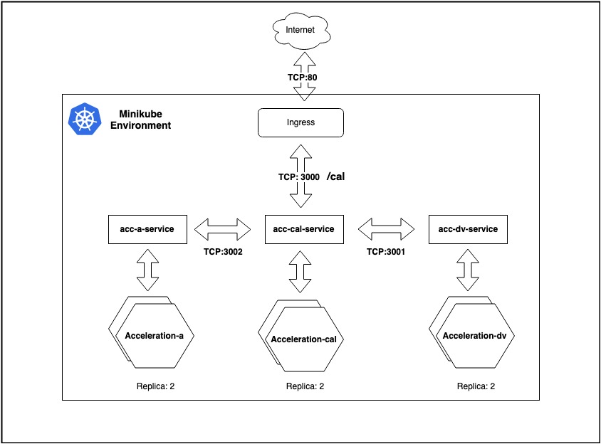

# Solution:

Architecture Diagram:



This solution tested successfully on Minikube
```bash
minikube version: v1.0.0
```
Steps:

1. Prerequisite

- Minikube Installed on the system (Tested on : v1.0.0).
- Helm Client Installed on the system (Tested on : v2.14.0).

2. Install Tiller.
```bash
helm init
```
3. Run the script run-me.sh
```bash
./run-me.sh
```
4. Result
```bash
ADMINs-MacBook-Pro:devops-challenge admin$ ./run-me.sh
[INFO]: Logged into the minikube docker environment
Sending build context to Docker daemon  24.58kB
Step 1/9 : FROM node:10.14.2-alpine
 ---> 01379e6790c7
Step 2/9 : MAINTAINER Raisal PA
 ---> Using cache
 ---> 285ea64fbae6
Step 3/9 : ENV APP_HOME=/app     WEB_PORT=3002
 ---> Using cache
 ---> a0ebc8b0d082
Step 4/9 : WORKDIR $APP_HOME
 ---> Using cache
 ---> 2dc97957b275
Step 5/9 : COPY . $APP_HOME
 ---> Using cache
 ---> 2dfa3bb092ba
Step 6/9 : RUN adduser -D myapp &&     yarn install && yarn build && chown -R myapp: $APP_HOME
 ---> Using cache
 ---> b0094d997ccc
Step 7/9 : USER myapp
 ---> Using cache
 ---> ae56a6208fec
Step 8/9 : EXPOSE $WEB_PORT
 ---> Using cache
 ---> 21861dafcf2d
Step 9/9 : CMD yarn start
 ---> Using cache
 ---> 6ab14b715df0
Successfully built 6ab14b715df0
Successfully tagged acceleration-a:latest
Sending build context to Docker daemon  35.33kB
Step 1/9 : FROM node:10.14.2-alpine
 ---> 01379e6790c7
Step 2/9 : MAINTAINER Raisal PA
 ---> Using cache
 ---> 285ea64fbae6
Step 3/9 : ENV APP_HOME=/app     WEB_PORT=3000
 ---> Using cache
 ---> 3bc925180942
Step 4/9 : WORKDIR $APP_HOME
 ---> Using cache
 ---> 06ac2ab30340
Step 5/9 : COPY . $APP_HOME
 ---> Using cache
 ---> 3fca9df2a155
Step 6/9 : RUN adduser -D myapp &&     yarn install && yarn build && chown -R myapp: $APP_HOME
 ---> Using cache
 ---> 2ad04b72bfc8
Step 7/9 : USER myapp
 ---> Using cache
 ---> 69de61c1e57a
Step 8/9 : EXPOSE $WEB_PORT
 ---> Using cache
 ---> 41b6f315bf61
Step 9/9 : CMD yarn start
 ---> Using cache
 ---> 4a080552d261
Successfully built 4a080552d261
Successfully tagged acceleration-calc:latest
Sending build context to Docker daemon  24.58kB
Step 1/9 : FROM node:10.14.2-alpine
 ---> 01379e6790c7
Step 2/9 : MAINTAINER Raisal PA
 ---> Using cache
 ---> 285ea64fbae6
Step 3/9 : ENV APP_HOME=/app     WEB_PORT=3001
 ---> Using cache
 ---> 2a91fb0181af
Step 4/9 : WORKDIR $APP_HOME
 ---> Using cache
 ---> a7a8717c3884
Step 5/9 : COPY . $APP_HOME
 ---> Using cache
 ---> bbb4682d02e5
Step 6/9 : RUN adduser -D myapp &&     yarn install && yarn build && chown -R myapp: $APP_HOME
 ---> Using cache
 ---> f5f71a659984
Step 7/9 : USER myapp
 ---> Using cache
 ---> 716bb82a773d
Step 8/9 : EXPOSE $WEB_PORT
 ---> Using cache
 ---> c56655823ca1
Step 9/9 : CMD yarn start
 ---> Using cache
 ---> ef0eed1b9365
Successfully built ef0eed1b9365
Successfully tagged acceleration-dv:latest
[Success]: All images are successfully builded
[INFO]: Enabling Addon Ingress for Minikube
✅  ingress was successfully enabled
[INFO]: Starting the Acceleration Application using Helm
NAME:   laughing-ferret
LAST DEPLOYED: Sun May 26 23:37:49 2019
NAMESPACE: default
STATUS: DEPLOYED

RESOURCES:
==> v1/Deployment
NAME                                          READY  UP-TO-DATE  AVAILABLE  AGE
acceleration-deployment-a-laughing-ferret     0/2    2           0          1s
acceleration-deployment-calc-laughing-ferret  0/2    2           0          0s
acceleration-deployment-dv-laughing-ferret    0/2    2           0          1s

==> v1/Pod(related)
NAME                                                           READY  STATUS             RESTARTS  AGE
acceleration-deployment-a-laughing-ferret-59ccd97874-bc68c     0/1    Pending            0         0s
acceleration-deployment-a-laughing-ferret-59ccd97874-rmdbf     0/1    ContainerCreating  0         0s
acceleration-deployment-calc-laughing-ferret-7f4954f9b6-6d7ds  0/1    Pending            0         0s
acceleration-deployment-calc-laughing-ferret-7f4954f9b6-xjvnz  0/1    ContainerCreating  0         0s
acceleration-deployment-dv-laughing-ferret-7cdc866d4f-d4mjm    0/1    ContainerCreating  0         0s
acceleration-deployment-dv-laughing-ferret-7cdc866d4f-vz27t    0/1    Pending            0         0s

==> v1/Service
NAME             TYPE       CLUSTER-IP      EXTERNAL-IP  PORT(S)   AGE
acc-a-service    ClusterIP  10.101.8.205    <none>       3002/TCP  1s
acc-cal-service  ClusterIP  10.108.48.41    <none>       3000/TCP  1s
acc-dv-service   ClusterIP  10.105.108.177  <none>       3001/TCP  1s

==> v1beta1/Ingress
NAME                  HOSTS  ADDRESS  PORTS  AGE
acceleration-ingress  *      80       0s


[Success]: Acceleration App Deployed


[Success]: Browse http://192.168.99.102/calc?vf=200&vi=5&t=123

```
